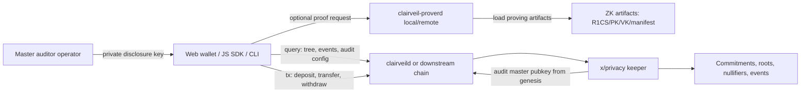

# Clairveil Threat Model

이 문서는 Clairveil repository 자체의 보안 경계를 정리합니다. Clairveil은 production chain이 아니라 reusable `x/privacy` module, reference `clairveild`, companion `clairveil-proverd`, fixture, walkthrough, SDK handoff를 제공하는 standalone privacy core입니다. 실제 production chain, bespoke features 결합, validator 운영, master auditor key custody, remote prover 노출 정책은 Clairveil을 가져다 쓰는 downstream project가 결정하고 책임집니다.

## 1. 기본 가정

- 본 repo의 `clairveild`는 sample/reference chain입니다.
- 외부 프로젝트는 Clairveil을 fork 하거나 `x/privacy`, proto, Go SDK helper, fixture, prover contract를 import 해서 사용합니다.
- `clairveil-proverd`는 local daemon과 remote sidecar 양쪽 모델을 지원하는 reference companion prover입니다.
- local prover, remote prover, browser/WASM prover 중 어떤 배포 모델을 쓸지는 downstream wallet/chain이 결정합니다.
- master auditor private key의 custody, 접근 제어, rotation, incident response는 downstream production project의 책임입니다.
- 이 문서는 formal third-party audit report가 아니라 repo-grounded threat model입니다.

## 2. Architecture

## 3. 주요 보호 대상

| Asset                                        | 왜 중요한가                                                                        | 본 repo의 처리                                                                                        |
| -------------------------------------------- | ---------------------------------------------------------------------------------- | ----------------------------------------------------------------------------------------------------- |
| User root seed, spend/view/disclosure secret | shielded note 소유권과 복호화 권한의 근원                                          | keyring 기반 derivation과 CLI/SDK helper를 제공하지만 production custody는 downstream 책임            |
| Local wallet note cache                      | note amount, randomness, nullifier, scan height를 담을 수 있음                     | JSON file을 `0600`으로 저장하고 corrupt file은 backup 후 reset                                        |
| Prepared transfer/withdraw prover payload    | proof 생성을 위해 note metadata, merkle path, signature, disclosure payload를 포함 | payload hash로 변경 감지, file mode `0600`, remote prover 전달 시 민감 데이터로 취급 필요             |
| ZK proving/verifying artifacts               | proof 생성/검증 신뢰 기반                                                          | manifest/env checksum, preflight mode, circuit config query 제공                                      |
| On-chain privacy state                       | commitments, historical roots, nullifiers, indexed privacy events                  | keeper가 canonical field validation, nullifier replay check, Merkle capacity/corrupt-state guard 수행 |
| Audit master private key                     | 모든 mandatory audit disclosure 복호화 가능                                        | private key custody는 downstream 책임, repo는 public key genesis/config와 decode flow 제공            |
| Prover bearer token                          | remote proof API 접근 제어                                                         | env var 기반 optional bearer auth 제공, production auth policy는 downstream 책임                      |

## 4. Trust Boundary

| Boundary                          | 신뢰하지 말아야 하는 입력                                                                               | 방어                                                                                                                                    |
| --------------------------------- | ------------------------------------------------------------------------------------------------------- | --------------------------------------------------------------------------------------------------------------------------------------- |
| Wallet/CLI to chain tx            | malformed proof, non-canonical field bytes, reused nullifier, wrong root, wrong audit disclosure target | `ValidateBasic`, keeper canonical validation, historical root check, nullifier check, Groth16 verification, audit master pubkey match   |
| Query client to chain             | invalid hex, missing commitment, corrupted tree state                                                   | query validation, `Internal` error for invalid Merkle state, bounded event pagination                                                   |
| Wallet to prover                  | oversized JSON, stale payload, tampered payload, untrusted remote prover                                | payload/proof hash validation, payload metadata validation, body limit in `proverservice.Handler`, optional bearer auth                 |
| Prover to artifact files          | missing/tampered R1CS/PK/VK                                                                             | artifact checksum support, preflight warn/strict mode                                                                                   |
| Restore/migration to Merkle state | partial `MerkleNode/*`, missing leaf, oversized rebuild                                                 | fixed-capacity guard, missing leaf/node explicit failure, `docs/clairveil-merkle-restore-sop-kr.md` requiring sampled path verification |
| Downstream chain integration      | wrong genesis audit pubkey, wrong denom/prefix, missing query routes, custom policy conflict            | integration guide, reference app, conformance fixture, walkthrough                                                                      |

## 5. Threat Table

| Threat                                       | Impact                                                           | Current mitigation                                                                                                              | Downstream requirement                                                                                              |
| -------------------------------------------- | ---------------------------------------------------------------- | ------------------------------------------------------------------------------------------------------------------------------- | ------------------------------------------------------------------------------------------------------------------- |
| Reuse an already spent note                  | Double spend attempt                                             | `MsgTransfer` and `MsgWithdraw` reject used nullifiers before state update                                                      | Keep keeper logic unchanged or preserve equivalent invariant during integration                                     |
| Submit proof for unknown root                | Spend from non-existing tree state                               | keeper checks historical root before proof acceptance                                                                           | Preserve historical root store through migration and snapshot restore                                               |
| Fill or overflow Merkle tree                 | Undefined root/path behavior or consensus risk                   | fixed depth 32 capacity guard, batch capacity check for 2-output transfer, explicit overflow failure                            | Monitor `leaf_count`, `remaining_leaves`, usage thresholds; plan new pool/circuit before exhaustion                 |
| Restore partial Merkle state                 | Path or append may silently use zero sibling if state is corrupt | required leaf/node checks on path/append/rebuild; `docs/clairveil-merkle-restore-sop-kr.md` requires sampled path recomputation | Restore `Leaf/*`, `MerkleNode/*`, `CommitmentIndex/*`, `HistoricalRoot/*`, and verify samples before resuming       |
| Omit mandatory audit disclosure              | Auditor cannot inspect transfer                                  | transfer validation requires configured audit pubkey, audit digest, audit target pubkey, audit payload                          | Set audit master pubkey in genesis for any production-like chain                                                    |
| Send fake disclosure payload                 | Recipient/auditor sees false plaintext                           | off-chain disclosure verifier recomputes digest and compares on-chain digest                                                    | Wallets must call disclosure verification, not just decrypt and display plaintext                                   |
| Expose remote prover without auth/rate limit | DoS, cost abuse, metadata leakage                                | sample service supports body limits, read timeouts, optional bearer auth                                                        | Put remote prover behind TLS, mandatory auth, network ACL, quota/rate limit, monitoring                             |
| Remote prover learns proof payload data      | Privacy metadata exposure to prover operator                     | architecture keeps proof generation separable but payload is still sensitive                                                    | Prefer local prover for high privacy, or treat remote prover as a trusted service with contractual/logging controls |
| Tamper ZK artifacts                          | Invalid or attacker-controlled proving/verifying setup           | checksum manifest/env and preflight support                                                                                     | Use strict preflight, signed artifact release, reproducible generation/provenance policy                            |
| Compromise master auditor private key        | All mandatory audit disclosures become readable by attacker      | repo does not custody production private keys                                                                                   | Use HSM/KMS or equivalent, least privilege, rotation, break-glass, audit logs                                       |

## 6. Code Evidence

- `x/privacy/keeper/msg_server.go`: validates roots, nullifiers, audit disclosure target, Groth16 proofs, and state writes.
- `x/privacy/keeper/tree.go`: defines `MerkleDepth`, `MaxMerkleLeaves`, capacity guard, rebuild bound, missing leaf/node checks.
- `x/privacy/keeper/grpc_query.go`: exposes tree/audit/disclosure/circuit queries and returns internal errors for invalid tree state.
- `x/privacy/types/msg.go`: validates canonical field bytes and mandatory user/audit disclosure structure.
- `x/privacy/client/sdk/transfer/payload.go`: builds and validates prepared transfer payload hashes and proof hashes.
- `x/privacy/client/sdk/withdraw/prover_payload.go`: validates withdraw prover payload metadata, asset denom/hash, recipient bytes, expiry, and payload hash.
- `x/privacy/client/sdk/disclosure/disclosure.go`: recomputes disclosure digest and verifies asset denom against asset id.
- `x/privacy/client/sdk/proverservice/service.go`: provides reference HTTP service with health/readiness, optional bearer auth, request body limit, and server timeouts.
- `x/privacy/zk/setup.go` and `x/privacy/zk/manifest.go`: load artifacts and support checksum manifest/env verification.

## 7. Residual Risk

- Groth16 artifact provenance and trusted setup ceremony are outside this repo's current security boundary. Downstream production should define artifact release, signing, reproducibility, and audit process.
- `clairveil-proverd` is a reference service. Remote production deployment still needs TLS termination, mandatory authentication, rate limits, abuse monitoring, and secret management.
- Local wallet files and prepared payloads are plaintext JSON with restrictive file permissions. This is acceptable for reference CLI/development, but production wallets should encrypt at rest.
- Health/readiness routes expose service metadata. This is low sensitivity for local samples, but remote deployments should keep them private or behind authenticated internal networks.
- The reference app intentionally excludes downstream EVM, policy module, precompile, IBC, wasm, and chain-specific governance/security policy.

## 8. Downstream Security Gate

Before a downstream project treats Clairveil as production-ready, it should at minimum complete:

1. Decide prover topology: browser/WASM, local daemon, remote sidecar, or hybrid.
2. Define remote prover authentication, TLS, rate limit, timeout, logging, and data-retention policy.
3. Define wallet storage encryption and seed/key derivation custody policy.
4. Define master auditor private key custody, rotation, and incident response.
5. Pin and verify ZK artifacts with strict preflight and signed artifact release metadata.
6. Run Clairveil conformance fixtures against the downstream JS/TS SDK.
7. Run local node e2e with downstream prefixes, denoms, genesis audit pubkey, and query routes.
8. Add chain-specific threat model for EVM, policy module, precompile, relayer, and frontend integrations.
