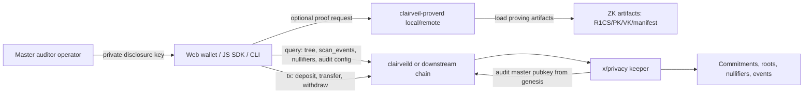

# Clairveil Threat Model

이 문서는 Clairveil repository 자체의 보안 경계를 정리합니다. Clairveil은 production chain이 아니라 reusable `x/privacy` module, reference `clairveild`, companion `clairveil-proverd`, fixture, walkthrough, SDK handoff를 제공하는 standalone privacy core입니다. 실제 production chain, bespoke features 결합, validator 운영, master auditor key custody, remote prover 노출 정책은 Clairveil을 가져다 쓰는 downstream project가 결정하고 책임집니다.

## 1. 기본 가정

- 본 repo의 `clairveild`는 sample/reference chain입니다.
- 외부 프로젝트는 Clairveil을 fork 하거나 `x/privacy`, proto, Go SDK helper, fixture, prover contract를 import 해서 사용합니다.
- `clairveil-proverd`는 local daemon과 remote sidecar 양쪽 모델을 지원하는 reference companion prover입니다.
- local prover, remote prover, browser/WASM prover 중 어떤 배포 모델을 쓸지는 downstream wallet/chain이 결정합니다.
- master auditor private key의 custody, 접근 제어, rotation, incident response는 downstream production project의 책임입니다.
- 이 문서는 formal third-party audit report가 아니라 repo-grounded threat model입니다.

## 2. Architecture

```mermaid
flowchart LR
  Wallet["Web wallet / JS SDK / CLI"] -->|"query: tree, scan_events, nullifiers, audit config"| Node["clairveild or downstream chain"]
  Wallet -->|"tx: deposit, transfer, withdraw"| Node
  Wallet -->|"optional proof request"| Prover["clairveil-proverd local/remote"]
  Prover -->|"load proving artifacts"| Artifacts["ZK artifacts: R1CS/PK/VK/manifest"]
  Node --> Privacy["x/privacy keeper"]
  Privacy --> State["Commitments, roots, nullifiers, events"]
  Auditor["Master auditor operator"] -->|"private disclosure key"| Wallet
  Privacy -->|"audit master pubkey from genesis"| Node
```

## 3. 주요 보호 대상

| Asset                                        | 왜 중요한가                                                                        | 본 repo의 처리                                                                                        |
| -------------------------------------------- | ---------------------------------------------------------------------------------- | ----------------------------------------------------------------------------------------------------- |
| User root seed, spend/view/disclosure secret | shielded note 소유권과 복호화 권한의 근원                                          | keyring 기반 derivation과 CLI/SDK helper를 제공하지만 production custody는 downstream 책임            |
| Local wallet note cache                      | note amount, randomness, nullifier, scan height를 담을 수 있음                     | JSON file을 `0600`으로 저장하고 corrupt file은 backup 후 reset                                        |
| Prepared transfer/withdraw prover payload    | proof 생성을 위해 note metadata, merkle path, signature, disclosure payload를 포함 | payload hash로 변경 감지, file mode `0600`, remote prover 전달 시 민감 데이터로 취급 필요             |
| Sender self-view disclosure payload          | sender가 보낸 transfer 상세를 복구하는 encrypted metadata                         | target pubkey를 event에 노출하지 않고 digest/payload만 저장, verification helper 제공                |
| Transfer view tag                           | signed canonical transfer effect에는 포함되지만 ownership 증거는 아닌 public 2-byte scan hint | tag를 untrusted hint로 취급하며 안전한 기본 wallet scan은 mismatch에서도 full decrypt 수행 |
| ZK proving/verifying artifacts               | proof 생성/검증 신뢰 기반 | consensus가 circuit set, VK hash, public-input schema digest를 고정하며 local verifier identity가 startup/readiness 전에 일치해야 함 |
| On-chain privacy state                       | commitments, historical roots, nullifiers, indexed privacy events                  | keeper가 canonical field validation, nullifier replay check, Merkle capacity/corrupt-state guard 수행 |
| Audit master private key                     | 모든 mandatory audit disclosure 복호화 가능                                        | private key custody는 downstream 책임, repo는 public key genesis/config와 decode flow 제공            |
| Prover bearer token                          | remote proof API 접근 제어                                                         | env var 기반 optional bearer auth 제공, production auth policy는 downstream 책임                      |

## 4. Trust Boundary

| Boundary                          | 신뢰하지 말아야 하는 입력                                                                               | 방어                                                                                                                                    |
| --------------------------------- | ------------------------------------------------------------------------------------------------------- | --------------------------------------------------------------------------------------------------------------------------------------- |
| Wallet/CLI to chain tx            | malformed proof/point/signature, duplicate/reused nullifier/commitment, wrong root/chain/expiry/recipient/output/disclosure | canonical decoder, local/global uniqueness, historical-root 재계산, `TransferIntentV2`/`SpendIntentV2`, gas-precharged Groth16 verification |
| Query client to chain             | invalid hex, missing commitment, corrupted tree state, malformed scan cursor/nullifier batch                          | query validation, `Internal` error for invalid Merkle state, bounded event pagination, cursor projection versioning                     |
| Wallet to prover                  | oversized JSON, stale/tampered authority-equivalent witness payload, endpoint correlation | payload/proof hash, body limit, optional bearer auth, default single endpoint/no failover; failover는 explicit opt-in |
| Prover/validator to artifact files | missing/tampered/stale R1CS/PK/VK | exact consensus identity 비교; validator는 VK만 필요하고 prover는 R1CS/PK를 lazy load하며 env checksum은 identity를 override하지 못함 |
| Restore/migration to Merkle state | partial `MerkleNode/*`, missing leaf, oversized rebuild                                                 | fixed-capacity guard, missing leaf/node explicit failure, `docs/clairveil-merkle-restore-sop-kr.md` requiring sampled path verification |
| Downstream chain integration      | wrong genesis audit pubkey, wrong denom/prefix, missing query routes, custom policy conflict            | integration guide, reference app, conformance fixture, walkthrough                                                                      |

## 5. Threat Table

| Threat                                       | Impact                                                           | Current mitigation                                                                                                              | Downstream requirement                                                                                              |
| -------------------------------------------- | ---------------------------------------------------------------- | ------------------------------------------------------------------------------------------------------------------------------- | ------------------------------------------------------------------------------------------------------------------- |
| Reuse an already spent note                  | Double spend attempt                                             | `MsgTransfer` and `MsgWithdraw` reject used nullifiers before state update                                                      | Keep keeper logic unchanged or preserve equivalent invariant during integration                                     |
| 한 transfer 안에서 input/nullifier 또는 output commitment 반복 | input value inflation 또는 state ambiguity | circuit distinctness와 canonical local-set 검사가 global lookup/state write보다 먼저 실행 | circuit/host 검사를 모두 보존 |
| deposit/transfer/genesis import 사이 commitment 재사용 | leaf identity와 scan/state corruption | global commitment index 하나와 duplicate-rejecting append/import | migration도 global uniqueness 검증 |
| transfer output/disclosure/chain/expiry 치환 | owner 의도와 다른 지출 | 단일 owner signature가 final effect-bound `TransferIntentV2`를 인증하고 keeper가 chain/payload digest 재계산 | prover output으로 intent를 재구성하지 않음 |
| withdraw expiry 연장, cross-chain replay, recipient 치환 | unauthorized transparent release | `SpendIntentV2`가 current-context chain domain, raw recipient digest, expiry를 묶고 `block_time >= expiry`에서 거부 | raw recipient byte와 absolute expiry를 그대로 보존 |
| Submit proof for unknown root                | Spend from non-existing tree state                               | keeper checks historical root before proof acceptance                                                                           | Preserve historical root store through migration and snapshot restore                                               |
| Fill or overflow Merkle tree                 | Undefined root/path behavior or consensus risk                   | fixed depth 32 capacity guard, batch capacity check for 2-output transfer, explicit overflow failure                            | Monitor `leaf_count`, `remaining_leaves`, usage thresholds; plan new pool/circuit before exhaustion                 |
| Restore partial Merkle state                 | Path or append may silently use zero sibling if state is corrupt | required leaf/node checks on path/append/rebuild; `docs/clairveil-merkle-restore-sop-kr.md` requires sampled path recomputation | Restore `Leaf/*`, `MerkleNode/*`, `CommitmentIndex/*`, `HistoricalRoot/*`, and verify samples before resuming       |
| Omit mandatory audit disclosure              | Auditor cannot inspect transfer                                  | transfer validation requires configured audit pubkey, audit digest, audit target pubkey, audit payload                          | Set audit master pubkey in genesis for any production-like chain                                                    |
| 작은 disclosure space dictionary attack 또는 fake plaintext | metadata recovery 또는 false disclosure 표시 | user/full digest가 독립 CSPRNG blinding을 쓰고 versioned plaintext가 blinding을 전달하며 verifier가 digest 재계산 | decrypt 후 반드시 검증하고 blinding을 재사용하지 않음 |
| Expose sender self-view target pubkey        | Observers can cluster sender transactions                         | self-view event omits target pubkey and stores only digest/payload                                                              | Do not add static sender disclosure pubkey to downstream event/indexer schemas                                      |
| Treat view tag mismatch as authoritative     | exact byte는 인증되지만 ownership derivation은 circuit constraint가 없는 tag 때문에 wallet이 자기 note를 놓칠 수 있음 | SDK safe default는 tag mismatch에서도 full decrypt하고 skip 동작은 explicit fast mode로만 허용                                  | Web/mobile wallet은 skip-on-mismatch mode를 켜기 전에 recovery/rescan 지원을 유지해야 함                           |
| Expose remote prover without auth/rate limit | DoS, cost abuse, metadata leakage                                | sample service supports body limits, read timeouts, optional bearer auth                                                        | Put remote prover behind TLS, mandatory auth, network ACL, quota/rate limit, monitoring                             |
| Remote prover learns proof payload data      | Privacy metadata exposure to prover operator                     | architecture keeps proof generation separable but payload is still sensitive                                                    | Prefer local prover for high privacy, or treat remote prover as a trusted service with contractual/logging controls |
| ZK artifact tamper/substitution | consensus split 또는 attacker-controlled setup | genesis/state가 ordered descriptor, VK SHA-256, public-input schema SHA-256을 고정하고 mismatch startup/readiness 차단 | signed release와 reproducible provenance도 추가 |
| Compromise master auditor private key        | All mandatory audit disclosures become readable by attacker      | repo does not custody production private keys                                                                                   | Use HSM/KMS or equivalent, least privilege, rotation, break-glass, audit logs                                       |
| Compromise sender disclosure private key     | Sent-transfer self-view payloads become readable by attacker     | self-view uses the same derived disclosure key custody boundary as other disclosure flows                                       | Protect disclosure keys with the same secure storage policy as spend/view material                                  |

## 6. Code Evidence

- `x/privacy/keeper/msg_server.go`: chain/intent witness 재계산, uniqueness/root/expiry 검증, proof gas precharge, failure state atomicity
- `x/privacy/keeper/tree.go`: defines `MerkleDepth`, `MaxMerkleLeaves`, capacity guard, rebuild bound, missing leaf/node checks.
- `x/privacy/keeper/grpc_query.go`: tree/audit/disclosure/circuit/scan/nullifier query를 노출하고 invalid tree state에는 internal error를 반환합니다.
- `x/privacy/types/intent.go`: non-reduced SHA-256 limb, chain/recipient/payload digest, ordered set, `TransferIntentV2`/`SpendIntentV2` contract
- `x/privacy/types/msg.go`: canonical field, local/global commitment/nullifier invariant, view tag, disclosure 구조 검증
- `x/privacy/client/sdk/transfer/payload.go`: output/disclosure/ciphertext 확정 후 single owner signature 생성, payload/proof hash 검증
- `x/privacy/client/sdk/scan/service.go`: view tag를 non-authoritative scan hint로 취급하고 cursor/batch query fallback을 지원합니다.
- `x/privacy/client/sdk/withdraw/prover_payload.go`: validates withdraw prover payload metadata, asset denom/hash, recipient bytes, expiry, and payload hash.
- `x/privacy/client/sdk/disclosure/disclosure.go`: recomputes disclosure digest and verifies asset denom against asset id.
- `x/privacy/client/sdk/proverservice/service.go`: provides reference HTTP service with health/readiness, optional bearer auth, request body limit, and server timeouts.
- `x/privacy/zk/identity.go`, `manifest.go`, `schema.go`: local VK-only verifier identity와 consensus 비교, exact public-input schema 고정

## 7. Residual Risk

- Groth16 artifact provenance and trusted setup ceremony are outside this repo's current security boundary. Downstream production should define artifact release, signing, reproducibility, and audit process.
- Session 1 artifact는 development 전용이며 formal trusted setup이나 external audit를 수행하지 않았습니다.
- `clairveil-proverd` is a reference service. Remote production deployment still needs TLS termination, mandatory authentication, rate limits, abuse monitoring, and secret management.
- Local wallet files and prepared payloads are plaintext JSON with restrictive file permissions. This is acceptable for reference CLI/development, but production wallets should encrypt at rest.
- Health/readiness routes expose service metadata. This is low sensitivity for local samples, but remote deployments should keep them private or behind authenticated internal networks.
- The reference app intentionally excludes downstream EVM, policy module, precompile, IBC, wasm, and chain-specific governance/security policy.

## 8. Downstream Security Gate

Before a downstream project treats Clairveil as production-ready, it should at minimum complete:

1. Decide prover topology: browser/WASM, local daemon, remote sidecar, or hybrid.
2. Define remote prover authentication, TLS, rate limit, timeout, logging, and data-retention policy.
3. Define wallet storage encryption and seed/key derivation custody policy.
4. Define master auditor private key custody, rotation, and incident response.
5. Consensus `privacy-note-v1` identity를 고정·검증하고 strict preflight와 signed artifact release metadata를 사용합니다.
6. Run Clairveil conformance fixtures against the downstream JS/TS SDK.
7. Run local node e2e with downstream prefixes, denoms, genesis audit pubkey, and query routes.
8. Add chain-specific threat model for EVM, policy module, precompile, relayer, and frontend integrations.
9. 사용자가 같은 private witness를 추가 endpoint에 보내는 것을 명시적으로 수락하지 않는 한 prover failover를 비활성화합니다.

## 9. Session 2 Foundation Threat Delta

Session 2는 active identity를 `privacy-note-v1`, canonical payload contract를 `privacy-fixed-v1`로 변경합니다. 이전 state, raw ciphertext, JSON note/disclosure plaintext, artifact, proof job, wallet cache는 의도적으로 호환되지 않습니다. 재사용하면 cross-version alias와 stale-root risk가 생기므로 지원하는 전환 방식은 fresh genesis, artifact/cache 삭제, full rescan입니다.

새롭거나 더 명확해진 trust-boundary threat는 아래와 같습니다.

- `AssetRegistryV1`이 one-to-one denom/32-byte asset-ID mapping의 consensus-authoritative source입니다. Missing, collision, corrupt reverse entry에서는 fail closed해야 하며 client가 untrusted note byte에서 display denom을 만들면 안 됩니다.
- Unified scan order는 `(height, global_sequence, output_index)`입니다. Partial cursor persistence는 output을 skip 또는 duplicate할 수 있고 다른 root의 path를 사용하면 witness가 invalid합니다. Current-root path는 persisted incremental node만 읽으므로 online historical-rebuild budget을 소비하지 않습니다. Cached current root가 없으면 `FailedPrecondition`으로 fail closed하고 offline repair를 요구하며 query는 cached tree state를 rebuild하거나 쓰지 않습니다. Non-current historical path는 persisted root/count/height metadata를 요구하며 public query는 최대 1,024 leaves와 keeper당 동시 rebuild 2개만 허용하고 그 이상은 `ResourceExhausted`를 반환합니다. Online bound를 넘으면 current root 또는 trusted local historical index를 사용합니다. 별도 offline recovery/export bound는 `MaxMerkleRebuildLeaves`(1,048,576)입니다. Remote historical root/path request는 provider에게 wallet timing과 state interest를 노출하므로 privacy warning을 유지합니다.
- Future `BatchJoinSplit16x32`의 12-input schema와 16/32 shape는 feasibility 목적으로만 동결되었습니다. Prototype protobuf/circuit을 live message, verifier artifact, prover route, payroll flow로 취급하면 아직 없는 production review와 consensus integration을 우회하게 됩니다.
- Role-aware loader는 불필요한 key 노출을 줄이지만 exact consensus identity는 계속 mandatory입니다. Reference admission bound는 circuit별 in-flight 1개와 queued 4개, positive 8 MiB body limit이며 0은 invalid입니다. Raw transport handler를 mount하면 이 expected service boundary를 우회합니다.
- Private witness disclosure는 operator가 늘 때 누적되므로 automatic prover failover를 끕니다. Client cancellation은 이미 실행 중인 in-process solver를 preempt하지 못해 admission과 memory가 계속 점유될 수 있습니다. Hard termination과 OOM containment에는 reference service 밖의 process isolation, limit, supervision이 필요합니다.

Reserve된 future public-input 순서는 `MerkleRoot`, `ChainDomainHi`, `ChainDomainLo`, `ExpiresAtUnix`, `InputCount`, `OutputCount`, `NullifierRoot`, `CommitmentRoot`, `UserDisclosureRoot`, `FullDisclosureRoot`, `PayloadDigestHi`, `PayloadDigestLo`입니다. 이후 production design에서 바꾸려면 새 identity/schema와 security review가 필요합니다.
