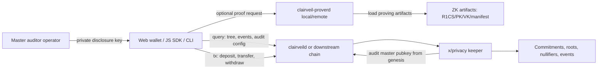

# Clairveil Threat Model

This document summarizes the security boundaries of the Clairveil repository itself. Clairveil is not a production chain. It is a standalone privacy core that provides a reusable `x/privacy` module, reference `clairveild`, companion `clairveil-proverd`, fixtures, walkthroughs, and SDK handoff material. The downstream project that imports Clairveil decides and owns the real production chain, bespoke feature coupling, validator operations, master auditor key custody, and remote prover exposure policy.

Korean version: [clairveil-threat-model-kr.md](clairveil-threat-model-kr.md)

## 1. Basic Assumptions

- `clairveild` in this repo is a sample/reference chain.
- External projects use Clairveil by forking it or importing `x/privacy`, proto, Go SDK helpers, fixtures, and prover contracts.
- `clairveil-proverd` is a reference companion prover that supports both local daemon and remote sidecar models.
- The downstream wallet/chain decides whether to deploy a local prover, remote prover, browser/WASM prover, or hybrid model.
- Custody, access control, rotation, and incident response for the master auditor private key are downstream production responsibilities.
- This is a repo-grounded threat model, not a formal third-party audit report.

## 2. Architecture

## 3. Main Protected Assets

| Asset | Why It Matters | Handling In This Repo |
| --- | --- | --- |
| User root seed, spend/view/disclosure secret | Root of shielded note ownership and decryption authority | Provides keyring-based derivation and CLI/SDK helpers, but production custody is downstream responsibility |
| Local wallet note cache | Can contain note amount, randomness, nullifier, and scan height | Stores JSON files with `0600` and backs up/resets corrupt files |
| Prepared transfer/withdraw prover payload | Contains note metadata, Merkle path, signature, and disclosure payload for proof generation | Detects mutation with payload hash, writes files with `0600`, and requires sensitive-data treatment when sent to remote prover |
| Sender self-view disclosure payload | Encrypted metadata for recovering details of the sender's own sent transfers | Stores only digest/payload without exposing the target pubkey in events, and provides verification helpers |
| ZK proving/verifying artifacts | Trust base for proof generation/verification | Provides manifest/env checksum, preflight mode, and circuit config query |
| On-chain privacy state | commitments, historical roots, nullifiers, indexed privacy events | Keeper performs canonical field validation, nullifier replay checks, and Merkle capacity/corrupt-state guards |
| Audit master private key | Can decrypt every mandatory audit disclosure | Private key custody is downstream responsibility; repo provides public key genesis/config and decode flow |
| Prover bearer token | Access control for remote proof API | Provides env-var based optional bearer auth; production auth policy is downstream responsibility |

## 4. Trust Boundary

| Boundary | Untrusted Input | Defense |
| --- | --- | --- |
| Wallet/CLI to chain tx | malformed proof, non-canonical field bytes, reused nullifier, wrong root, wrong audit disclosure target | `ValidateBasic`, keeper canonical validation, historical root check, nullifier check, Groth16 verification, audit master pubkey match |
| Query client to chain | invalid hex, missing commitment, corrupted tree state | query validation, `Internal` error for invalid Merkle state, bounded event pagination |
| Wallet to prover | oversized JSON, stale payload, tampered payload, untrusted remote prover | payload/proof hash validation, payload metadata validation, body limit in `proverservice.Handler`, optional bearer auth |
| Prover to artifact files | missing/tampered R1CS/PK/VK | artifact checksum support, preflight warn/strict mode |
| Restore/migration to Merkle state | partial `MerkleNode/*`, missing leaf, oversized rebuild | fixed-capacity guard, missing leaf/node explicit failure, `docs/clairveil-merkle-restore-sop.md` requiring sampled path verification |
| Downstream chain integration | wrong genesis audit pubkey, wrong denom/prefix, missing query routes, custom policy conflict | integration guide, reference app, conformance fixture, walkthrough |

## 5. Threat Table

| Threat | Impact | Current Mitigation | Downstream Requirement |
| --- | --- | --- | --- |
| Reuse an already spent note | Double spend attempt | `MsgTransfer` and `MsgWithdraw` reject used nullifiers before state update | Keep keeper logic unchanged or preserve equivalent invariant during integration |
| Submit proof for unknown root | Spend from non-existing tree state | keeper checks historical root before proof acceptance | Preserve historical root store through migration and snapshot restore |
| Fill or overflow Merkle tree | Undefined root/path behavior or consensus risk | fixed depth 32 capacity guard, batch capacity check for 2-output transfer, explicit overflow failure | Monitor `leaf_count`, `remaining_leaves`, usage thresholds; plan new pool/circuit before exhaustion |
| Restore partial Merkle state | Path or append may silently use zero sibling if state is corrupt | required leaf/node checks on path/append/rebuild; `docs/clairveil-merkle-restore-sop.md` requires sampled path recomputation | Restore `Leaf/*`, `MerkleNode/*`, `CommitmentIndex/*`, `HistoricalRoot/*`, and verify samples before resuming |
| Omit mandatory audit disclosure | Auditor cannot inspect transfer | transfer validation requires configured audit pubkey, audit digest, audit target pubkey, audit payload | Set audit master pubkey in genesis for any production-like chain |
| Send fake disclosure payload | Recipient/auditor/sender self-view sees false plaintext | off-chain disclosure verifier recomputes digest and compares on-chain digest | Wallets must call disclosure verification, not just decrypt and display plaintext |
| Expose sender self-view target pubkey | Observers can cluster sender transactions | self-view events omit the target pubkey and store only digest/payload | Do not add static sender disclosure pubkeys to downstream event/indexer schemas |
| Expose remote prover without auth/rate limit | DoS, cost abuse, metadata leakage | sample service supports body limits, read timeouts, optional bearer auth | Put remote prover behind TLS, mandatory auth, network ACL, quota/rate limit, monitoring |
| Remote prover learns proof payload data | Privacy metadata exposure to prover operator | architecture keeps proof generation separable but payload is still sensitive | Prefer local prover for high privacy, or treat remote prover as a trusted service with contractual/logging controls |
| Tamper ZK artifacts | Invalid or attacker-controlled proving/verifying setup | checksum manifest/env and preflight support | Use strict preflight, signed artifact release, reproducible generation/provenance policy |
| Compromise master auditor private key | All mandatory audit disclosures become readable by attacker | repo does not custody production private keys | Use HSM/KMS or equivalent, least privilege, rotation, break-glass, audit logs |
| Compromise sender disclosure private key | Sent-transfer self-view payloads become readable by attacker | self-view uses the same derived disclosure key custody boundary as other disclosure flows | Protect disclosure keys with the same secure storage policy as spend/view material |

## 6. Code Evidence

- `x/privacy/keeper/msg_server.go`: validates roots, nullifiers, audit disclosure target, Groth16 proofs, and state writes.
- `x/privacy/keeper/tree.go`: defines `MerkleDepth`, `MaxMerkleLeaves`, capacity guard, rebuild bound, missing leaf/node checks.
- `x/privacy/keeper/grpc_query.go`: exposes tree/audit/disclosure/circuit queries and returns internal errors for invalid tree state.
- `x/privacy/types/msg.go`: validates canonical field bytes and user/audit/self-view disclosure structure.
- `x/privacy/client/sdk/transfer/payload.go`: builds and validates prepared transfer payload hashes and proof hashes.
- `x/privacy/client/sdk/withdraw/prover_payload.go`: validates withdraw prover payload metadata, asset denom/hash, recipient bytes, expiry, and payload hash.
- `x/privacy/client/sdk/disclosure/disclosure.go`: recomputes disclosure digest and verifies asset denom against asset id.
- `x/privacy/client/sdk/proverservice/service.go`: provides reference HTTP service with health/readiness, optional bearer auth, request body limit, and server timeouts.
- `x/privacy/zk/setup.go` and `x/privacy/zk/manifest.go`: load artifacts and support checksum manifest/env verification.

## 7. Residual Risk

- Groth16 artifact provenance and trusted setup ceremony are outside this repo's current security boundary. Downstream production should define artifact release, signing, reproducibility, and audit process.
- `clairveil-proverd` is a reference service. Remote production deployment still needs TLS termination, mandatory authentication, rate limits, abuse monitoring, and secret management.
- Local wallet files and prepared payloads are plaintext JSON with restrictive file permissions. This is acceptable for reference CLI/development, but production wallets should encrypt at rest.
- Health/readiness routes expose service metadata. This is low sensitivity for local samples, but remote deployments should keep them private or behind authenticated internal networks.
- The reference app intentionally excludes downstream EVM, policy module, precompile, IBC, wasm, and chain-specific governance/security policy.

## 8. Downstream Security Gate

Before a downstream project treats Clairveil as production-ready, it should at minimum complete:

1. Decide prover topology: browser/WASM, local daemon, remote sidecar, or hybrid.
2. Define remote prover authentication, TLS, rate limit, timeout, logging, and data-retention policy.
3. Define wallet storage encryption and seed/key derivation custody policy.
4. Define master auditor private key custody, rotation, and incident response.
5. Pin and verify ZK artifacts with strict preflight and signed artifact release metadata.
6. Run Clairveil conformance fixtures against the downstream JS/TS SDK.
7. Run local node e2e with downstream prefixes, denoms, genesis audit pubkey, and query routes.
8. Add chain-specific threat model for EVM, policy module, precompile, relayer, and frontend integrations.
