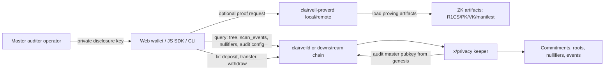

# Clairveil Threat Model

This document summarizes the security boundaries of the Clairveil repository itself. Clairveil is not a production chain. It is a standalone privacy core that provides a reusable `x/privacy` module, reference `clairveild`, companion `clairveil-proverd`, fixtures, walkthroughs, and SDK handoff material. The downstream project that imports Clairveil decides and owns the real production chain, bespoke feature coupling, validator operations, master auditor key custody, and remote prover exposure policy.

Korean version: [clairveil-threat-model-kr.md](clairveil-threat-model-kr.md)

## 1. Basic Assumptions

- `clairveild` in this repo is a sample/reference chain.
- External projects use Clairveil by forking it or importing `x/privacy`, proto, Go SDK helpers, fixtures, and prover contracts.
- `clairveil-proverd` is a reference companion prover that supports both local daemon and remote sidecar models.
- The downstream wallet/chain decides whether to deploy a local prover, remote prover, browser/WASM prover, or hybrid model.
- Custody, access control, rotation, and incident response for the master auditor private key are downstream production responsibilities.
- This is a repo-grounded threat model, not a formal third-party audit report.

## 2. Architecture

```mermaid
flowchart LR
  Wallet["Web wallet / JS SDK / CLI"] -->|"query: tree, scan_events, nullifiers, audit config"| Node["clairveild or downstream chain"]
  Wallet -->|"tx: deposit, transfer, withdraw"| Node
  Wallet -->|"optional proof request"| Prover["clairveil-proverd local/remote"]
  Prover -->|"load proving artifacts"| Artifacts["ZK artifacts: R1CS/PK/VK/manifest"]
  Node --> Privacy["x/privacy keeper"]
  Privacy --> State["Commitments, roots, nullifiers, events"]
  Auditor["Master auditor operator"] -->|"private disclosure key"| Wallet
  Privacy -->|"audit master pubkey from genesis"| Node
```

## 3. Main Protected Assets

| Asset | Why It Matters | Handling In This Repo |
| --- | --- | --- |
| User root seed, spend/view/disclosure secret | Root of shielded note ownership and decryption authority | Provides keyring-based derivation and CLI/SDK helpers, but production custody is downstream responsibility |
| Local wallet note cache | Can contain note amount, randomness, nullifier, and scan height | Stores JSON files with `0600` and backs up/resets corrupt files |
| Prepared transfer/withdraw prover payload | Contains note metadata, Merkle path, signature, and disclosure payload for proof generation | Detects mutation with payload hash, writes files with `0600`, and requires sensitive-data treatment when sent to remote prover |
| Sender self-view disclosure payload | Encrypted metadata for recovering details of the sender's own sent transfers | Stores only digest/payload without exposing the target pubkey in events, and provides verification helpers |
| Transfer view tags | Public 2-byte scan hints included in the signed canonical transfer effect but not ownership evidence | Treats tags as untrusted hints; safe default wallet scan full-decrypts on mismatch |
| ZK proving/verifying artifacts | Trust base for proof generation/verification | Consensus pins circuit set, VK hashes, and public-input schema digests; local verifier identity must match before startup/readiness |
| On-chain privacy state | commitments, historical roots, nullifiers, indexed privacy events | Keeper performs canonical field validation, nullifier replay checks, and Merkle capacity/corrupt-state guards |
| Audit master private key | Can decrypt every mandatory audit disclosure | Private key custody is downstream responsibility; repo provides public key genesis/config and decode flow |
| Prover bearer token | Access control for remote proof API | Provides env-var based optional bearer auth; production auth policy is downstream responsibility |

## 4. Trust Boundary

| Boundary | Untrusted Input | Defense |
| --- | --- | --- |
| Wallet/CLI to chain tx | malformed proof/point/signature, duplicate or reused nullifier/commitment, wrong root/chain/expiry/recipient/output/disclosure | canonical decoders, local/global uniqueness checks, historical-root recomputation, `TransferIntentV2`/`SpendIntentV2`, gas-precharged Groth16 verification |
| Query client to chain | invalid hex, missing commitment, corrupted tree state, malformed scan cursor/nullifier batch | query validation, `Internal` error for invalid Merkle state, bounded event pagination, cursor projection versioning |
| Wallet to prover | oversized JSON, stale/tampered authority-equivalent witness payload, endpoint correlation | payload/proof hash validation, body limit, optional bearer auth, single endpoint/no failover by default; failover requires explicit opt-in |
| Prover/validator to artifact files | missing/tampered/stale R1CS/PK/VK | exact consensus identity comparison; validators require VK only, provers lazily load R1CS/PK; environment checksums cannot override identity |
| Restore/migration to Merkle state | partial `MerkleNode/*`, missing leaf, oversized rebuild | fixed-capacity guard, missing leaf/node explicit failure, `docs/clairveil-merkle-restore-sop.md` requiring sampled path verification |
| Downstream chain integration | wrong genesis audit pubkey, wrong denom/prefix, missing query routes, custom policy conflict | integration guide, reference app, conformance fixture, walkthrough |

## 5. Threat Table

| Threat | Impact | Current Mitigation | Downstream Requirement |
| --- | --- | --- | --- |
| Reuse an already spent note | Double spend attempt | `MsgTransfer` and `MsgWithdraw` reject used nullifiers before state update | Keep keeper logic unchanged or preserve equivalent invariant during integration |
| Repeat one input/nullifier or output commitment inside a transfer | Inflate input value or create ambiguous output/state | circuit distinctness plus canonical local-set checks run before global lookups or state writes | Preserve both circuit and host checks |
| Reuse a commitment across deposit, transfer, or genesis import | Ambiguous leaf identity and scan/state corruption | one global commitment index and duplicate-rejecting append/import path | Migration tooling must preserve and validate global uniqueness |
| Replace transfer output, disclosure metadata, chain, or expiry | Spend owner funds with a different final effect | one owner signature authenticates the final effect-bound `TransferIntentV2`; keeper recomputes chain/payload digests | Do not reconstruct intent from untrusted prover output |
| Extend withdraw expiry, replay on another chain, or replace recipient | Unauthorized transparent release | `SpendIntentV2` binds current-context chain domain, raw recipient digest, and expiry; rejection begins at `block_time >= expiry` | Preserve raw recipient bytes and absolute expiry exactly |
| Submit proof for unknown root | Spend from non-existing tree state | keeper checks historical root before proof acceptance | Preserve historical root store through migration and snapshot restore |
| Fill or overflow Merkle tree | Undefined root/path behavior or consensus risk | fixed depth 32 capacity guard, batch capacity check for 2-output transfer, explicit overflow failure | Monitor `leaf_count`, `remaining_leaves`, usage thresholds; plan new pool/circuit before exhaustion |
| Restore partial Merkle state | Path or append may silently use zero sibling if state is corrupt | required leaf/node checks on path/append/rebuild; `docs/clairveil-merkle-restore-sop.md` requires sampled path recomputation | Restore `Leaf/*`, `MerkleNode/*`, `CommitmentIndex/*`, `HistoricalRoot/*`, and verify samples before resuming |
| Omit mandatory audit disclosure | Auditor cannot inspect transfer | transfer validation requires configured audit pubkey, audit digest, audit target pubkey, audit payload | Set audit master pubkey in genesis for any production-like chain |
| Dictionary-attack a small disclosure space or send fake plaintext | Recover metadata offline or display false disclosure | user and full disclosure digests use independent CSPRNG blindings carried in versioned plaintext; verifier recomputes the digest | Wallets must verify after decryption and never reuse blindings |
| Expose sender self-view target pubkey | Observers can cluster sender transactions | self-view events omit the target pubkey and store only digest/payload | Do not add static sender disclosure pubkeys to downstream event/indexer schemas |
| Treat view tag mismatch as authoritative | Wallet may miss an owned note if a tx/event carries a tag whose exact bytes are authenticated but whose ownership derivation is not circuit-constrained | SDK safe default full-decrypts on tag mismatch and only allows skip behavior as explicit fast mode | Web/mobile wallets must keep recovery/rescan support before enabling any skip-on-mismatch mode |
| Expose remote prover without auth/rate limit | DoS, cost abuse, metadata leakage | sample service supports body limits, read timeouts, optional bearer auth | Put remote prover behind TLS, mandatory auth, network ACL, quota/rate limit, monitoring |
| Remote prover learns proof payload data | Privacy metadata exposure to prover operator | architecture keeps proof generation separable but payload is still sensitive | Prefer local prover for high privacy, or treat remote prover as a trusted service with contractual/logging controls |
| Tamper or substitute ZK artifacts | Consensus split or attacker-controlled verifier/prover setup | genesis/state pins exact ordered descriptors, VK SHA-256, and public-input schema SHA-256; mismatch blocks startup/readiness | Also use signed releases and reproducible generation/provenance policy |
| Compromise master auditor private key | All mandatory audit disclosures become readable by attacker | repo does not custody production private keys | Use HSM/KMS or equivalent, least privilege, rotation, break-glass, audit logs |
| Compromise sender disclosure private key | Sent-transfer self-view payloads become readable by attacker | self-view uses the same derived disclosure key custody boundary as other disclosure flows | Protect disclosure keys with the same secure storage policy as spend/view material |

## 6. Code Evidence

- `x/privacy/keeper/msg_server.go`: recomputes chain/intent witnesses, validates uniqueness/roots/expiry, precharges proof gas, and keeps failure paths state-atomic.
- `x/privacy/keeper/tree.go`: defines `MerkleDepth`, `MaxMerkleLeaves`, capacity guard, rebuild bound, missing leaf/node checks.
- `x/privacy/keeper/grpc_query.go`: exposes tree/audit/disclosure/circuit/scan/nullifier queries and returns internal errors for invalid tree state.
- `x/privacy/types/intent.go`: defines non-reduced SHA-256 limbs, chain/recipient/payload digests, ordered sets, and `TransferIntentV2`/`SpendIntentV2` golden contracts.
- `x/privacy/types/msg.go`: validates canonical fields, local/global commitment/nullifier invariants, transfer view tags, and disclosure structure.
- `x/privacy/client/sdk/transfer/payload.go`: finalizes outputs/disclosures/ciphertexts before creating one owner signature and validates payload/proof hashes.
- `x/privacy/client/sdk/scan/service.go`: treats view tags as non-authoritative scan hints and supports cursor/batch query fallback.
- `x/privacy/client/sdk/withdraw/prover_payload.go`: validates withdraw prover payload metadata, asset denom/hash, recipient bytes, expiry, and payload hash.
- `x/privacy/client/sdk/disclosure/disclosure.go`: recomputes disclosure digest and verifies asset denom against asset id.
- `x/privacy/client/sdk/proverservice/service.go`: provides reference HTTP service with health/readiness, optional bearer auth, request body limit, and server timeouts.
- `x/privacy/zk/identity.go`, `manifest.go`, and `schema.go`: compare local VK-only verifier identity to consensus and pin exact public-input schemas.

## 7. Residual Risk

- Groth16 artifact provenance and trusted setup ceremony are outside this repo's current security boundary. Downstream production should define artifact release, signing, reproducibility, and audit process.
- Session 1 artifacts are development-only; no formal trusted setup or external audit has been performed.
- `clairveil-proverd` is a reference service. Remote production deployment still needs TLS termination, mandatory authentication, rate limits, abuse monitoring, and secret management.
- Local wallet files and prepared payloads are plaintext JSON with restrictive file permissions. This is acceptable for reference CLI/development, but production wallets should encrypt at rest.
- Health/readiness routes expose service metadata. This is low sensitivity for local samples, but remote deployments should keep them private or behind authenticated internal networks.
- The reference app intentionally excludes downstream EVM, policy module, precompile, IBC, wasm, and chain-specific governance/security policy.

## 8. Downstream Security Gate

Before a downstream project treats Clairveil as production-ready, it should at minimum complete:

1. Decide prover topology: browser/WASM, local daemon, remote sidecar, or hybrid.
2. Define remote prover authentication, TLS, rate limit, timeout, logging, and data-retention policy.
3. Define wallet storage encryption and seed/key derivation custody policy.
4. Define master auditor private key custody, rotation, and incident response.
5. Pin and verify the consensus `privacy-note-v1` identity, use strict preflight, and add signed artifact release metadata.
6. Run Clairveil conformance fixtures against the downstream JS/TS SDK.
7. Run local node e2e with downstream prefixes, denoms, genesis audit pubkey, and query routes.
8. Add chain-specific threat model for EVM, policy module, precompile, relayer, and frontend integrations.
9. Keep prover failover disabled unless the user explicitly accepts sending the same private witness to additional endpoints.

## 9. Session 2 Foundation Threat Delta

Session 2 changes the active identity to `privacy-note-v1` and the canonical payload contract to `privacy-fixed-v1`. Earlier state, raw ciphertext, JSON note/disclosure plaintext, artifacts, proof jobs, and wallet caches are deliberately incompatible. Reusing them creates cross-version aliasing and stale-root risks, so the supported transition is fresh genesis plus artifact/cache deletion and full rescan.

New or clarified trust-boundary threats are:

- `AssetRegistryV1` is consensus-authoritative for the one-to-one denom/32-byte asset-ID mapping. Missing, colliding, or corrupt reverse entries must fail closed; clients must not construct a display denom from untrusted note bytes.
- Unified scan ordering is `(height, global_sequence, output_index)`. Partial cursor persistence can skip or duplicate outputs, and using a path from a different root invalidates the witness. A current-root incremental path has no 1,048,576-leaf cap. A non-current historical path uses persisted root/count/height metadata, but its nodes are rebuilt under a 1,048,576-leaf bound; above that cap, use the current root or a trusted local historical index. Remote historical root/path requests also reveal wallet timing and state interest to the provider, so retain that privacy warning.
- The future `BatchJoinSplit16x32` 12-input schema and 16/32 shape are frozen only for feasibility. Treating the prototype protobuf/circuit as a live message, verifier artifact, prover route, or payroll flow would bypass the missing production review and consensus integration.
- The role-aware loader reduces unnecessary key exposure, but exact consensus identity remains mandatory. The reference admission bound is one in-flight plus four queued jobs per circuit and a positive 8 MiB body limit; zero is invalid. Mounting the raw transport handler bypasses this expected service boundary.
- Automatic prover failover stays off because private witness disclosure compounds across operators. Client cancellation cannot preempt an already running in-process solver, so admission can remain occupied and memory can remain allocated. Hard termination and OOM containment require process isolation, limits, and supervision outside the reference service.

The reserved future public-input order is `MerkleRoot`, `ChainDomainHi`, `ChainDomainLo`, `ExpiresAtUnix`, `InputCount`, `OutputCount`, `NullifierRoot`, `CommitmentRoot`, `UserDisclosureRoot`, `FullDisclosureRoot`, `PayloadDigestHi`, `PayloadDigestLo`; any later production design change requires a new identity/schema and security review.
